# Enterprise-Deployment-Guide
# 🚀 Deployment Guide: Windows Server 2019 Domain Controller

### Core Configuration Data

* **Domain Name:** `Globe.com`
* **Static IP:** `192.168.10.10/24`
* **Gateway:** `192.168.10.1`
* **DNS Server:** `127.0.0.1`

---

## Phase 1: Initial System Setup (Networking & Time)

Before installing roles, ensure the system is properly configured with a static IP and the correct time zone.

* **Option A: Graphical User Interface (GUI)**
1. **Time Zone:** Right-click the clock in the taskbar > **Adjust date/time** > Set your correct time zone.
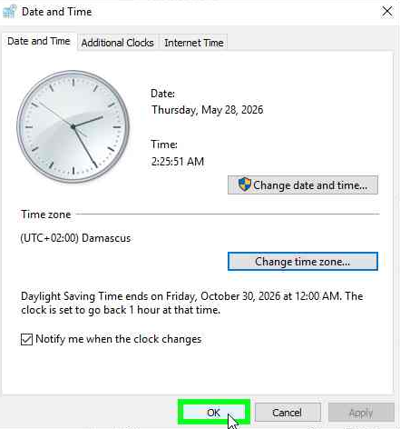


2. **Network IP:** Open `ncpa.cpl` > Right-click **Ethernet** > **Properties** > **IPv4 Properties**. Enter:
* IP: `192.168.10.10` | Subnet: `255.255.255.0` | Gateway: `192.168.10.1`
* DNS: `127.0.0.1`

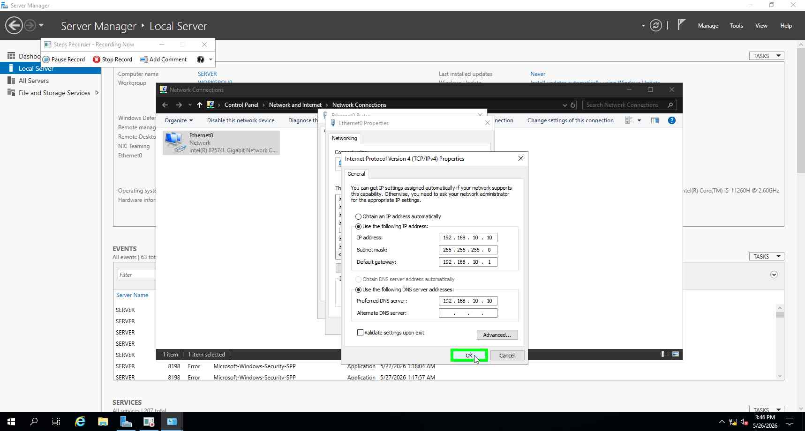


3. **Rename Server:** In **Server Manager** > **Local Server** > Click **Computer name** > **Change**. Rename to `SVR-PDC` and restart.


* **Option B: PowerShell (Automation)**
```powershell
# Update Time Zone
Set-TimeZone -Id "Arab Standard Time"

# Set Static IP and DNS
New-NetIPAddress -InterfaceAlias "Ethernet" -IPAddress 192.168.10.10 -PrefixLength 24 -DefaultGateway 192.168.10.1
Set-DnsClientServerAddress -InterfaceAlias "Ethernet" -ServerAddresses 127.0.0.1

# Rename and Restart
Rename-Computer -NewName "SVR-PDC" -Restart

```


---

## Phase 2: Installing Active Directory Domain Services (AD DS)

* **Option A: GUI**
1. In **Server Manager**, click **Manage** > **Add roles and features**.
2. Select **Active Directory Domain Services** from the server roles list.
3. Click **Add Features** in the pop-up, then proceed to finish the installation.


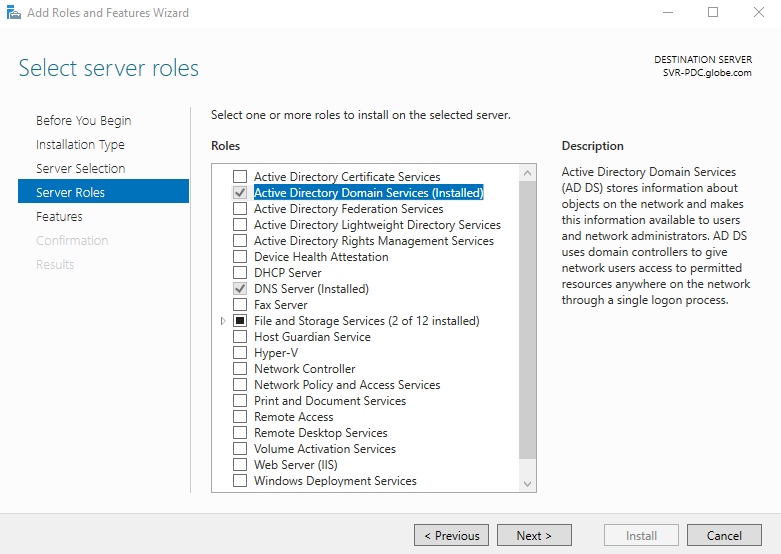


* **Option B: PowerShell**
```powershell
Install-WindowsFeature -Name AD-Domain-Services -IncludeManagementTools

```


---

## Phase 3: Promoting Server to Domain Controller (Forest Creation)

* **Option A: GUI**
1. In **Server Manager**, click the **Notification flag** (Yellow triangle) > **Promote this server to a domain controller**.
2. Select **Add a new forest** and enter `Globe.com` as the root domain name.
3. On the **Domain Controller Options** screen, set a strong **DSRM password**.
4. Proceed through the following screens (DNS Options, NetBIOS, Paths) clicking **Next**.
5. Once the "Prerequisites Check" passes, click **Install**.


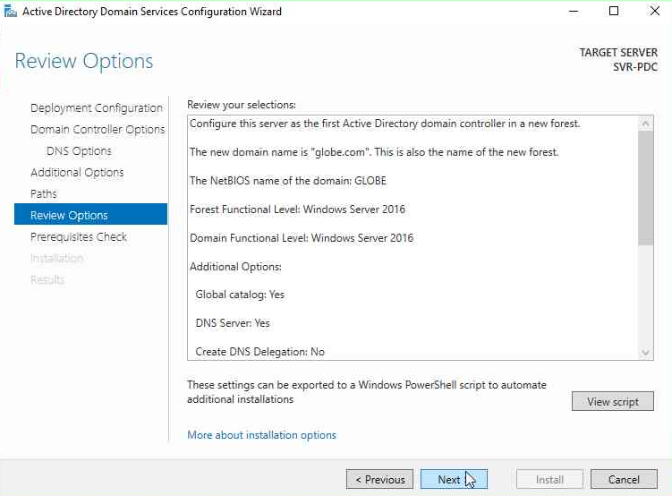


* **Option B: PowerShell**
```powershell
# Promotion command (Prompts for DSRM password)
Install-ADDSForest -DomainName "Globe.com" -InstallDns -Force

```


---

## Phase 4: Verification

Once the system restarts, verify the environment:

1. **Check DNS:** Open CMD and run `nslookup Globe.com`. It should return `192.168.10.10`.
2. **Verify AD:** Open **Active Directory Users and Computers** and ensure the `Globe.com` domain structure is visible.

---
To fully configure the DNS server to serve internal devices, resolve local domain names (like `Globe.com`), and allow all client machines to access the internet seamlessly, we must set up two main components: **DNS Forwarders** and a **Reverse Lookup Zone**.

---

## Phase 1: Configuring DNS Forwarders (For Internet Access)

DNS Forwarders are public DNS servers (such as Google or Cloudflare) that your local Domain Controller queries when an internal client requests an external internet address that the local server does not recognize.

### 🔹 Option A: Using the Graphical User Interface (GUI)

1. Open **Server Manager**, click on **Tools** in the top right corner, and select **DNS**.
2. In the left pane, right-click on your server's name (e.g., `SVR-PDC`) and select **Properties**.
3. Navigate to the **Forwarders** tab and click the **Edit** button.
4. Add the following highly reliable global DNS server IP addresses:
* Google Primary DNS: `8.8.8.8`
* Cloudflare Primary DNS: `1.1.1.1`


5. Click **OK**, then **Apply**, and **OK** again.

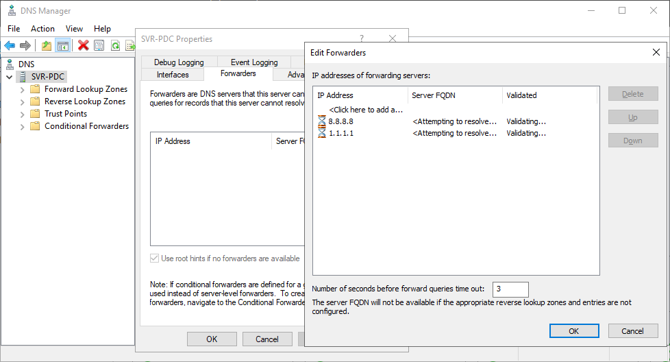

### 🔹 Option B: Using PowerShell (Automation)

Open PowerShell as Administrator and run the following command to set the forwarders instantly:

```powershell
# Set Google and Cloudflare as DNS Forwarders for the local server
Set-DnsServerForwarder -IPAddress "8.8.8.8","1.1.1.1" -PassThru

```

---

## Phase 2: Creating a Reverse Lookup Zone

A Reverse Lookup Zone translates IP addresses back into hostnames (the exact opposite of a forward lookup). It is highly recommended in an Active Directory environment to ensure network stability and allow various services to function without errors.

### 🔹 Option A: Using the Graphical User Interface (GUI)

1. In the **DNS Manager**, expand your server name in the left pane.
2. Right-click on **Reverse Lookup Zones** and select **New Zone**.
3. In the New Zone Wizard, click **Next**. Choose **Primary zone** and ensure **Store the zone in Active Directory** is checked, then click **Next**.
4. For the Replication Scope, select the second option: `To all DNS servers running on domain controllers in this domain` and click **Next**.
5. Select **IPv4 Reverse Lookup Zone** and click **Next**.
6. In the **Network ID** field, type the first three octets of your network: `192.168.10` and click **Next**.
7. On the Dynamic Update screen, leave the secure default option: `Allow only secure dynamic updates`. Click **Next**, then **Finish**.


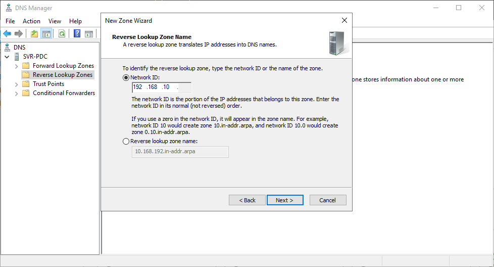

### 🔹 Option B: Using PowerShell (Automation)

Run this command to create an AD-integrated Reverse Lookup Zone immediately:

```powershell
# Create a Reverse Lookup Zone for the 192.168.10.0 network and replicate it across the domain
Add-DnsServerPrimaryZone -NetworkId "192.168.10.0/24" -ReplicationScope "Domain"

```

---

## Phase 3: Client Configuration and Final Verification

For client devices to successfully access the internet and resolve local domain resources, their network settings must be strictly pointed to your new DNS server.

**1. Client Network Adapter Setup:**

* Ensure that the **Preferred DNS server** on every client machine in your network is set strictly to the Domain Controller's IP address: `192.168.10.10`.
* *(Note: Never set 8.8.8.8 as a primary or secondary DNS on a client's network card in an AD environment, otherwise, they will lose connection to the local domain).*

**2. Testing and Verification from a Client Machine:**
Open Command Prompt (CMD) on any client PC and run the following tests:

```cmd
# Test 1: Verify local domain resolution
nslookup Globe.com

# Test 2: Verify external internet resolution via DNS Forwarders
nslookup google.com

```

*If both commands return the correct IP addresses, your DNS infrastructure is professionally deployed and fully operational.*


---


This hierarchical structure for Organizational Units (OUs) is excellent. It securely isolates service accounts and adopts a scalable architecture that clearly separates the IT infrastructure (systems and services) from corporate departments (users and computers).

Here is the professional engineering guide to building this exact structure, continuing with our standardized format (integrating both GUI and PowerShell options for each phase):

---

# 📂 Guide: Building the Organizational Unit (OU) Hierarchy

> **Professional Note:** When creating these OUs, we will enable the **Protect container from accidental deletion** feature. This is a critical best practice to safeguard the vital Active Directory environment against human error.

---

## Phase 1: Creating the Root OUs

In this phase, we will build the top-level units directly under the root domain `DC=GLOBE,DC=COM`.

### 🔹 Option A: Using the Graphical User Interface (GUI)

1. Open **Server Manager**, click on **Tools**, and select **Active Directory Users and Computers**.
2. Right-click on your domain name `Globe.com`, select **New**, then click **Organizational Unit**.
3. In the Name field, type: `GLOBE_ServiceAccounts`. Ensure that the *Protect container from accidental deletion* checkbox is selected, then click **OK**.
4. Repeat the previous steps to create the second root OU named: `GLOBE`.

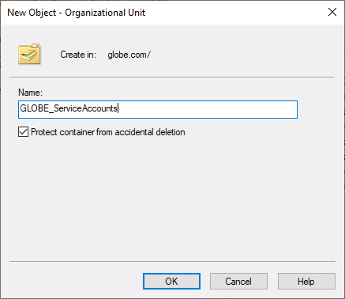

### 🔹 Option B: Using PowerShell (Automation)

Open PowerShell as Administrator and run the following commands:

```powershell
# Create root OUs directly under the domain root
New-ADOrganizationalUnit -Name "GLOBE_ServiceAccounts" -Path "DC=GLOBE,DC=COM" -ProtectedFromAccidentalDeletion $true
New-ADOrganizationalUnit -Name "GLOBE" -Path "DC=GLOBE,DC=COM" -ProtectedFromAccidentalDeletion $true

```

---

## Phase 2: Creating the Infrastructure Tier

This phase branches out the systems and network services (Hypervisors, Nextcloud, Storage) and separates the users from the groups within each service.

### 🔹 Option A: Using the Graphical User Interface (GUI)

1. In **Active Directory Users and Computers**, expand the domain and right-click on the previously created `GLOBE` OU.
2. Select **New** -> **Organizational Unit** and name it `Infrastructure`.
3. Next, right-click on the new `Infrastructure` OU and create 3 sub-OUs inside it one by one: `Hypervisors`, `Nextcloud`, and `Storage`.
4. Enter each of these three OUs, right-click inside, and create the respective User and Group sub-OUs (e.g., inside the Nextcloud OU, create `NC_Users` and `NC_Groups`).

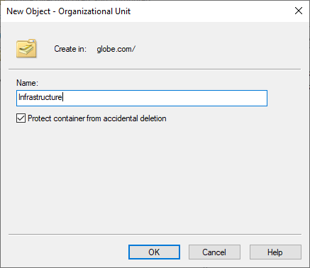

### 🔹 Option B: Using PowerShell (Automation)

Run this script block to build the entire Infrastructure tier instantly:

```powershell
# 1. Create the main Infrastructure container inside GLOBE
New-ADOrganizationalUnit -Name "Infrastructure" -Path "OU=GLOBE,DC=GLOBE,DC=COM" -ProtectedFromAccidentalDeletion $true

# Define the parent path variable to simplify the script
$infraPath = "OU=Infrastructure,OU=GLOBE,DC=GLOBE,DC=COM"

# 2. Create the System sub-OUs
New-ADOrganizationalUnit -Name "Hypervisors" -Path $infraPath -ProtectedFromAccidentalDeletion $true
New-ADOrganizationalUnit -Name "Nextcloud" -Path $infraPath -ProtectedFromAccidentalDeletion $true
New-ADOrganizationalUnit -Name "Storage" -Path $infraPath -ProtectedFromAccidentalDeletion $true

# 3. Create Users and Groups sub-OUs for each system
# Hypervisors
New-ADOrganizationalUnit -Name "HV_Groups" -Path "OU=Hypervisors,$infraPath" -ProtectedFromAccidentalDeletion $true
New-ADOrganizationalUnit -Name "HV_Users" -Path "OU=Hypervisors,$infraPath" -ProtectedFromAccidentalDeletion $true

# Nextcloud
New-ADOrganizationalUnit -Name "NC_Groups" -Path "OU=Nextcloud,$infraPath" -ProtectedFromAccidentalDeletion $true
New-ADOrganizationalUnit -Name "NC_Users" -Path "OU=Nextcloud,$infraPath" -ProtectedFromAccidentalDeletion $true

# Storage
New-ADOrganizationalUnit -Name "Storage_Groups" -Path "OU=Storage,$infraPath" -ProtectedFromAccidentalDeletion $true
New-ADOrganizationalUnit -Name "Storage_Users" -Path "OU=Storage,$infraPath" -ProtectedFromAccidentalDeletion $true

```

---

## Phase 3: Creating the Corporate Departments Tier (MD)

This phase establishes the administrative structure of the company, categorizing computers, groups, and users based on specific technical departments (IT, HR).

### 🔹 Option A: Using the Graphical User Interface (GUI)

1. Right-click on the main `GLOBE` OU, select **New** -> **Organizational Unit**, and name it `MD`.
2. Inside the `MD` OU, create 3 primary categorization OUs: `MD_Computers`, `MD_Groups`, and `MD_Users`.
3. Navigate into each one to create the department-specific sub-OUs:
* Inside `MD_Computers`: Create `MD_Computers_IT`.
* Inside `MD_Groups`: Create `MD_Groups_HR` and `MD_Groups_IT`.
* Inside `MD_Users`: Create `MD_Users_HR` and `MD_Users_IT`.


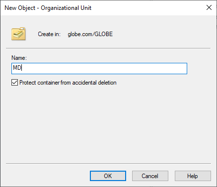

### 🔹 Option B: Using PowerShell (Automation)

Run the following commands to instantly build the departmental and administrative structure:

```powershell
# 1. Create the main MD container for departments inside GLOBE
New-ADOrganizationalUnit -Name "MD" -Path "OU=GLOBE,DC=GLOBE,DC=COM" -ProtectedFromAccidentalDeletion $true

# Define the parent path variable
$mdPath = "OU=MD,OU=GLOBE,DC=GLOBE,DC=COM"

# 2. Create the core object categorization OUs (Computers, Groups, Users)
New-ADOrganizationalUnit -Name "MD_Computers" -Path $mdPath -ProtectedFromAccidentalDeletion $true
New-ADOrganizationalUnit -Name "MD_Groups" -Path $mdPath -ProtectedFromAccidentalDeletion $true
New-ADOrganizationalUnit -Name "MD_Users" -Path $mdPath -ProtectedFromAccidentalDeletion $true

# 3. Create the department-specific branches (IT / HR)
# Computers Sub-OUs
New-ADOrganizationalUnit -Name "MD_Computers_IT" -Path "OU=MD_Computers,$mdPath" -ProtectedFromAccidentalDeletion $true

# Groups Sub-OUs
New-ADOrganizationalUnit -Name "MD_Groups_HR" -Path "OU=MD_Groups,$mdPath" -ProtectedFromAccidentalDeletion $true
New-ADOrganizationalUnit -Name "MD_Groups_IT" -Path "OU=MD_Groups,$mdPath" -ProtectedFromAccidentalDeletion $true

# Users Sub-OUs
New-ADOrganizationalUnit -Name "MD_Users_HR" -Path "OU=MD_Users,$mdPath" -ProtectedFromAccidentalDeletion $true
New-ADOrganizationalUnit -Name "MD_Users_IT" -Path "OU=MD_Users,$mdPath" -ProtectedFromAccidentalDeletion $true

```

---

## Phase 4: Final Verification

To ensure that all Organizational Units have been created in the correct hierarchy without any path or spelling errors:

* **Verify programmatically via PowerShell:**
Run the following command to list the entire OU tree under the main domain, neatly formatted by Name and Distinguished Path:
```powershell
Get-ADOrganizationalUnit -Filter * -SearchBase "DC=GLOBE,DC=COM" | Select-Object Name, DistinguishedName | Format-Table -AutoSize

```

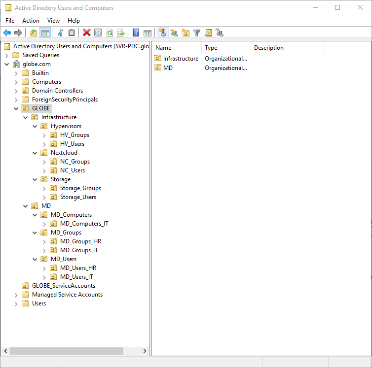

*(This will output a clean, organized list containing all Distinguished Names (DN), perfectly matching the tree structure you requested. The AD environment is now ready to host accounts and Group Policy Objects (GPOs).*


Here is the comprehensive guide for creating Users and Groups and distributing permissions within the established **Globe.com** OU hierarchy. This guide is designed around security best practices, such as isolating service accounts and utilizing Role-Based Access Control (RBAC) via specialized IT management groups.

---

# 👥 Identity & Access Provisioning Guide

> **Security Best Practice:** All Service Accounts must be configured with highly complex passwords, have the "Password never expires" option enabled, and ideally be stripped of interactive logon rights to protect the system.

---

## Phase 1: Provisioning Service Accounts in `GLOBE_ServiceAccounts`

In this isolated container, we will create dedicated accounts for each system service or integration (e.g., storage, hypervisors, and file sharing).

### 🔹 Option A: Using the Graphical User Interface (GUI)

1. Open **Active Directory Users and Computers**.
2. Navigate to the `GLOBE_ServiceAccounts` OU, right-click it, and select **New** -> **User**.
3. Fill in the details as follows:
* **First Name / Full Name:** `svc_proxmox` (Repeat later for `svc_nextcloud` & `svc_storage`).
* **User logon name:** `svc_proxmox`.


4. Click **Next** and enter a complex password.
5. **Uncheck** *User must change password at next logon*.
6. **Check** *Password never expires*.
7. Click **Next**, then **Finish**.

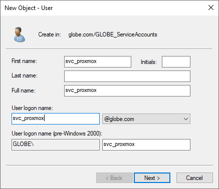
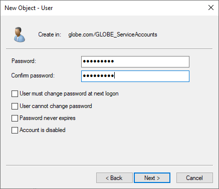


### 🔹 Option B: Using PowerShell (Automation)

Run the following script block to create all three service accounts at once using a secure password prompt:

```powershell
# Prompt for a unified secure password for service accounts
$SecurePassword = Read-Host -AsSecureString "Enter a secure password for service accounts"
$TargetOU = "OU=GLOBE_ServiceAccounts,DC=GLOBE,DC=COM"

# Create Service Accounts
New-ADUser -Name "svc_proxmox" -SamAccountName "svc_proxmox" -UserPrincipalName "svc_proxmox@globe.com" -Path $TargetOU -AccountPassword $SecurePassword -Enabled $true -PasswordNeverExpires $true
New-ADUser -Name "svc_nextcloud" -SamAccountName "svc_nextcloud" -UserPrincipalName "svc_nextcloud@globe.com" -Path $TargetOU -AccountPassword $SecurePassword -Enabled $true -PasswordNeverExpires $true
New-ADUser -Name "svc_storage" -SamAccountName "svc_storage" -UserPrincipalName "svc_storage@globe.com" -Path $TargetOU -AccountPassword $SecurePassword -Enabled $true -PasswordNeverExpires $true

```

---

## Phase 2: Provisioning Infrastructure Tier Users & Groups

For every service in the Infrastructure tier, we will create two control groups (`_admins` for full privileges, and `_access` for standard access) and one admin user who is automatically added to their respective `_admins` group.

### 🔹 Option A: Using the Graphical User Interface (GUI)

1. Navigate to `OU=Infrastructure` and open a service folder (e.g., `Hypervisors`).
2. Go into the `HV_Groups` OU, right-click, and select **New** -> **Group**.
3. Create a group named `HV_admins` and another named `HV_access` (Set Group scope to *Global* and Group type to *Security*).
4. Go to the `HV_Users` OU and create a user named `HV_admin`.
5. After creating the user, right-click `HV_admin`, select **Properties** -> **Member Of** tab -> click **Add**, type `HV_admins`, and click **OK**.
6. Repeat these exact steps for the `Nextcloud` and `Storage` OUs.

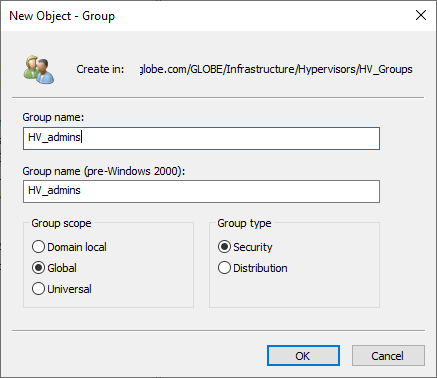

### 🔹 Option B: Using PowerShell (Automation)

Run this script to automate the creation of infrastructure groups, users, and their bindings instantly:

```powershell
$Pass = Read-Host -AsSecureString "Enter admin user password"
$InfraRoot = "OU=Infrastructure,OU=GLOBE,DC=GLOBE,DC=COM"

# --- 1. Hypervisors Setup ---
New-ADGroup -Name "HV_admins" -GroupScope Global -GroupCategory Security -Path "OU=HV_Groups,OU=Hypervisors,$InfraRoot"
New-ADGroup -Name "HV_access" -GroupScope Global -GroupCategory Security -Path "OU=HV_Groups,OU=Hypervisors,$InfraRoot"
New-ADUser -Name "HV_admin" -SamAccountName "HV_admin" -UserPrincipalName "HV_admin@globe.com" -Path "OU=HV_Users,OU=Hypervisors,$InfraRoot" -AccountPassword $Pass -Enabled $true
Add-ADGroupMember -Identity "HV_admins" -Members "HV_admin"

# --- 2. Nextcloud Setup ---
New-ADGroup -Name "NC_admins" -GroupScope Global -GroupCategory Security -Path "OU=NC_Groups,OU=Nextcloud,$InfraRoot"
New-ADGroup -Name "NC_access" -GroupScope Global -GroupCategory Security -Path "OU=NC_Groups,OU=Nextcloud,$InfraRoot"
New-ADUser -Name "NC_admin" -SamAccountName "NC_admin" -UserPrincipalName "NC_admin@globe.com" -Path "OU=NC_Users,OU=Nextcloud,$InfraRoot" -AccountPassword $Pass -Enabled $true
Add-ADGroupMember -Identity "NC_admins" -Members "NC_admin"

# --- 3. Storage Setup ---
New-ADGroup -Name "Storage_admins" -GroupScope Global -GroupCategory Security -Path "OU=Storage_Groups,OU=Storage,$InfraRoot"
New-ADGroup -Name "Storage_access" -GroupScope Global -GroupCategory Security -Path "OU=Storage_Groups,OU=Storage,$InfraRoot"
New-ADUser -Name "Storage_admin" -SamAccountName "Storage_admin" -UserPrincipalName "Storage_admin@globe.com" -Path "OU=Storage_Users,OU=Storage,$InfraRoot" -AccountPassword $Pass -Enabled $true
Add-ADGroupMember -Identity "Storage_admins" -Members "Storage_admin"

```

---

## Phase 3: Provisioning Corporate Departments (MD Tier)

Here, we will create general departmental groups (HR, IT), followed by specialized IT management groups (Storage, Proxmox, Nextcloud, AD) to distribute administrative tasks. Finally, we will create users and assign them to their respective groups.

### 🔹 Option A: Using the Graphical User Interface (GUI)

1. Navigate to `OU=MD` and then into each department's groups folder:
* Inside `OU=MD_Groups_HR`: Create the security group `MD_Group_HR`.
* Inside `OU=MD_Groups_IT`: Create the security group `MD_Group_IT`.


2. **Create IT Specialized Groups (Inside `OU=MD_Groups_IT`):**
Right-click and create the following groups:
* `IT_Mgr_Storage` (For storage management)
* `IT_Mgr_Proxmox` (For virtualization management)
* `IT_Mgr_Nextcloud` (For private cloud management)
* `IT_Mgr_ActiveDirectory` (For Domain Controller management)


3. Navigate to the Users folders to provision employees (e.g., create `it_user1` inside `OU=MD_Users_IT`, then add them to both `MD_Group_IT` and their specialized management group like `IT_Mgr_Proxmox`).


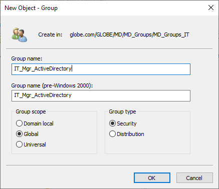

### 🔹 Option B: Using PowerShell (Automation)

Run this script to instantly build the base and specialized departmental groups:

```powershell
$MD_Root = "OU=MD,OU=GLOBE,DC=GLOBE,DC=COM"

# 1. Create general department groups
New-ADGroup -Name "MD_Group_HR" -GroupScope Global -GroupCategory Security -Path "OU=MD_Groups_HR,OU=MD_Groups,$MD_Root"
New-ADGroup -Name "MD_Group_IT" -GroupScope Global -GroupCategory Security -Path "OU=MD_Groups_IT,OU=MD_Groups,$MD_Root"

# 2. Create specialized IT management groups (Easily expandable later)
$IT_Groups_Path = "OU=MD_Groups_IT,OU=MD_Groups,$MD_Root"

New-ADGroup -Name "IT_Mgr_Storage" -GroupScope Global -GroupCategory Security -Path $IT_Groups_Path
New-ADGroup -Name "IT_Mgr_Proxmox" -GroupScope Global -GroupCategory Security -Path $IT_Groups_Path
New-ADGroup -Name "IT_Mgr_Nextcloud" -GroupScope Global -GroupCategory Security -Path $IT_Groups_Path
New-ADGroup -Name "IT_Mgr_ActiveDirectory" -GroupScope Global -GroupCategory Security -Path $IT_Groups_Path

# 3. Example: Create an IT user and bind them to the general and a specialized group
$UserPass = Read-Host -AsSecureString "Enter password for IT test user"
New-ADUser -Name "it_admin_pro" -SamAccountName "it_admin_pro" -UserPrincipalName "it_admin_pro@globe.com" -Path "OU=MD_Users_IT,OU=MD_Users,$MD_Root" -AccountPassword $UserPass -Enabled $true

# Bind the IT user to their groups
Add-ADGroupMember -Identity "MD_Group_IT" -Members "it_admin_pro"
Add-ADGroupMember -Identity "IT_Mgr_Proxmox" -Members "it_admin_pro"

```

---

## Phase 4: Verification

To programmatically verify that all groups, users, and their bindings have been configured correctly without errors:

* **Verify specialized group membership (RBAC check):**
Run the following command to see the members of an IT management group to ensure successful binding:
```powershell
Get-ADGroupMember -Identity "IT_Mgr_Proxmox" | Select-Object Name, SamAccountName | Format-Table

```


* **Verify isolated Service Accounts:**
```powershell
Get-ADUser -Filter * -SearchBase "OU=GLOBE_ServiceAccounts,DC=GLOBE,DC=COM" | Select-Object Name, UserPrincipalName

```
